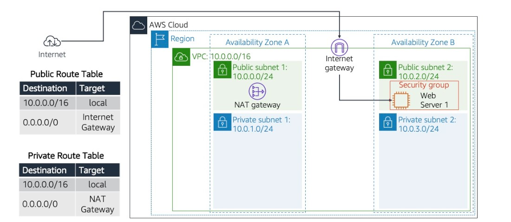
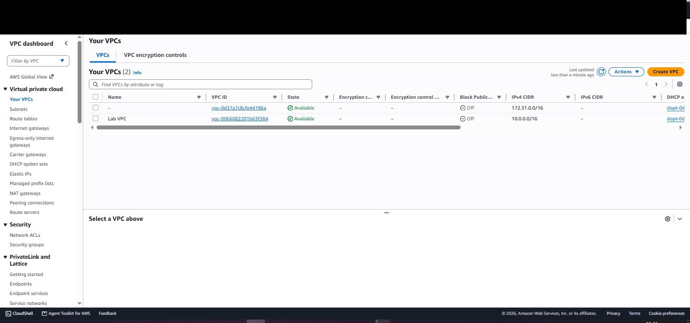
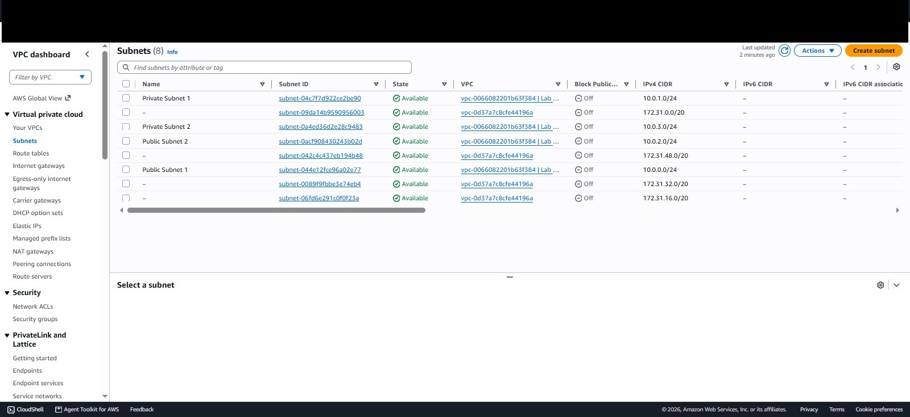
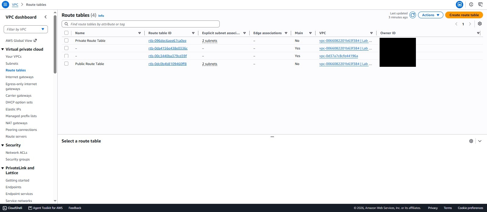
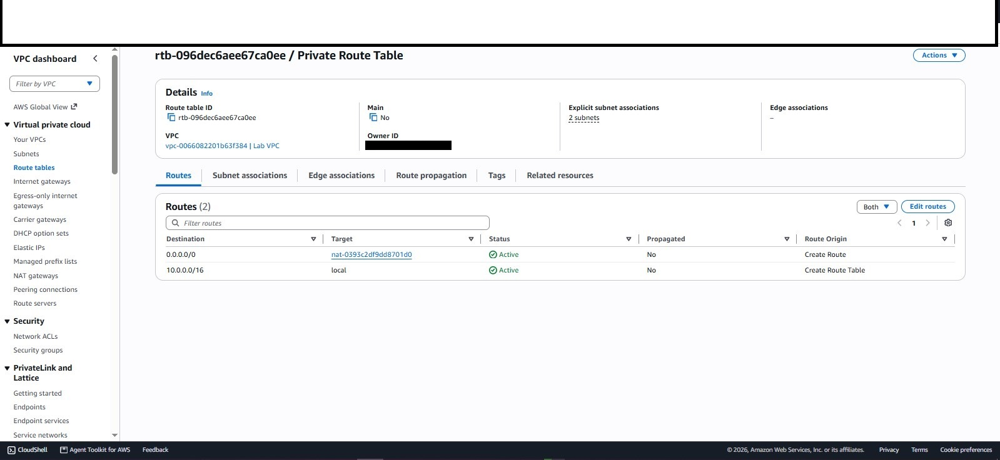
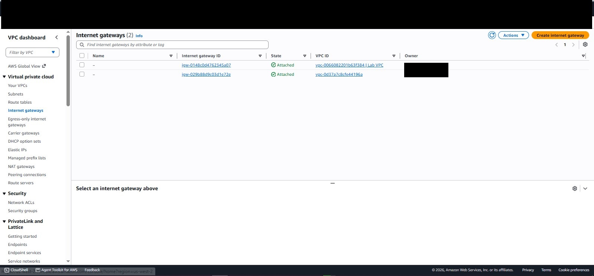
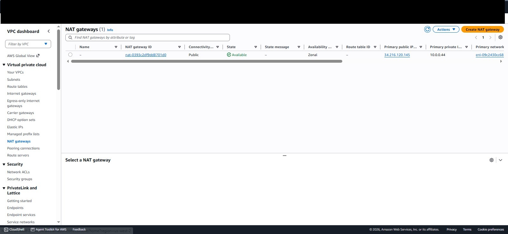
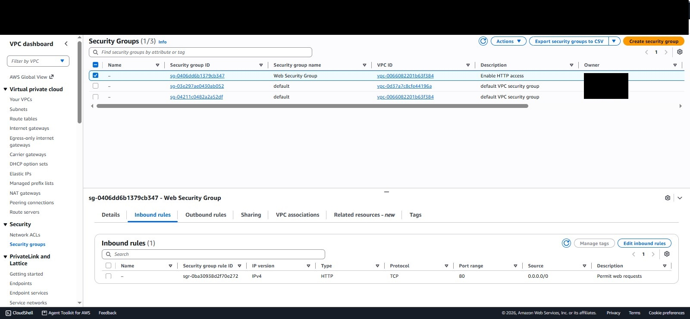
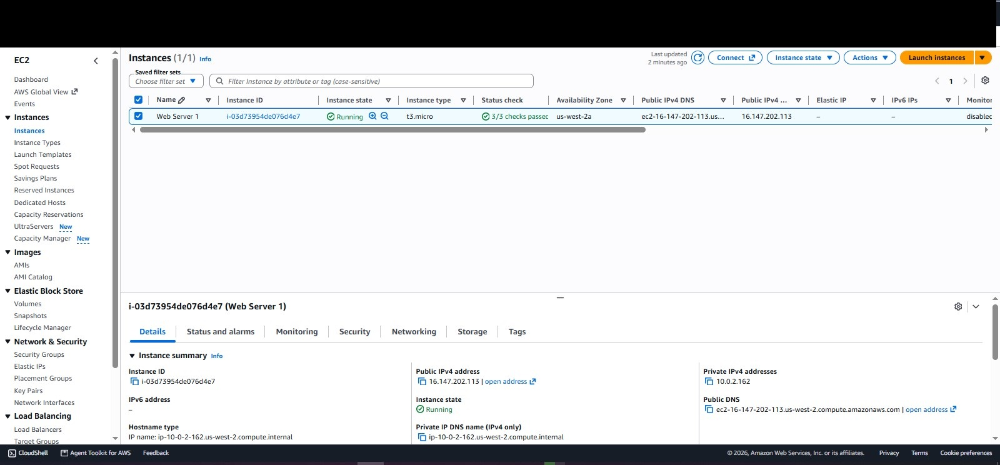
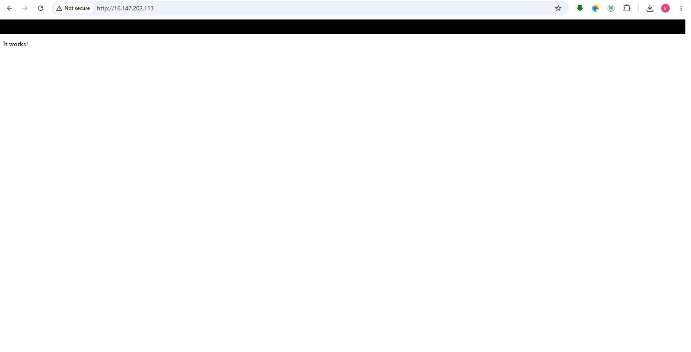

# AWS Multi-AZ VPC with Web Server

A production-ready Amazon VPC built from scratch, featuring public and private subnets across two Availability Zones, a NAT Gateway for secure outbound access, and an Apache web server deployed via User Data automation.

## Overview

This project demonstrates a real-world AWS networking architecture designed for high availability and security. It includes:

- A VPC with a `/16` CIDR block
- Public and private subnets spread across two Availability Zones
- An Internet Gateway for public internet access
- A NAT Gateway for outbound access from private subnets
- Separate route tables for public and private traffic
- A security group allowing HTTP access
- An EC2 instance running Apache, provisioned automatically with User Data

## Architecture



**Traffic flow:**

1. A user on the internet reaches the **Internet Gateway**
2. The IGW forwards traffic to the **public subnet**
3. The **public route table** routes `0.0.0.0/0` to the IGW
4. The **security group** allows HTTP (port 80)
5. The **EC2 instance** running Apache serves the page
6. Private subnets reach the internet through the **NAT Gateway** (outbound only)

## AWS Services Used

| Service | Purpose |
| :--- | :--- |
| Amazon VPC | Isolated network (`10.0.0.0/16`) |
| Subnets | Four subnets across two AZs |
| Internet Gateway | Connects the VPC to the internet |
| NAT Gateway | Allows private subnet outbound access |
| Route Tables | Direct traffic based on destination |
| Security Groups | Instance-level firewall |
| Amazon EC2 | Runs the Apache web server |
| User Data | Automates server provisioning on launch |

## Subnet Layout

| Subnet | CIDR | Availability Zone | Type |
| :--- | :--- | :--- | :--- |
| Public Subnet 1 | `10.0.0.0/24` | us-west-2a | Public |
| Private Subnet 1 | `10.0.1.0/24` | us-west-2a | Private |
| Public Subnet 2 | `10.0.2.0/24` | us-west-2a | Public |
| Private Subnet 2 | `10.0.3.0/24` | us-west-2a | Private |

## Route Tables

### Public Route Table

| Destination | Target |
| :--- | :--- |
| `10.0.0.0/16` | local |
| `0.0.0.0/0` | Internet Gateway |

### Private Route Table

| Destination | Target |
| :--- | :--- |
| `10.0.0.0/16` | local |
| `0.0.0.0/0` | NAT Gateway |

## Project Structure

```
aws-multi-az-vpc-web-server/
├── README.md
├── scripts/
│   └── user-data.sh
├── screenshots/
│   ├── 01-architecture.jpg
│   ├── 02-vpc.jpg
│   ├── 03-subnets.jpg
│   ├── 04-public-route-table.jpg
│   ├── 05-private-route-table.jpg
│   ├── 06-internet-gateway.jpg
│   ├── 07-nat-gateway.jpg
│   ├── 08-security-group.jpg
│   ├── 09-instance-running.jpg
│   ├── 10-live-website.jpg
│   └── 12-command-history.jpg
└── docs/
    ── troubleshooting.md
```

## User Data Script

The EC2 instance was provisioned with the following User Data script, which installs Apache and deploys the web application automatically on first boot:

```bash
#!/bin/bash
yum install -y httpd mysql php
wget https://aws-tc-largeobjects.s3.us-west-2.amazonaws.com/CUR-TF-100-RESTRT-1/267-lab-NF-build-vpc-web-server/s3/lab-app.zip
unzip lab-app.zip -d /var/www/html/
chkconfig httpd on
service httpd start
```

## Setup Instructions

### 1. Create the VPC

1. Open the VPC Console, then choose **Create VPC**, then choose **VPC and more**
2. Configure:

| Field | Value |
| :--- | :--- |
| Name tag | `Lab VPC` |
| IPv4 CIDR | `10.0.0.0/16` |
| AZs | 1 |
| Public subnets | 1 |
| Private subnets | 1 |
| Public subnet CIDR | `10.0.0.0/24` |
| Private subnet CIDR | `10.0.1.0/24` |
| NAT gateways | In 1 AZ |

3. Click **Create VPC**

### 2. Add Additional Subnets

Create two more subnets in a second AZ:

| Subnet | CIDR |
| :--- | :--- |
| Public Subnet 2 | `10.0.2.0/24` |
| Private Subnet 2 | `10.0.3.0/24` |

### 3. Associate Subnets to Route Tables

- Public Subnet 2 goes to Public Route Table
- Private Subnet 2 goes to Private Route Table

### 4. Create the Security Group

Create `Web Security Group` in Lab VPC with:

| Type | Port | Source |
| :--- | :--- | :--- |
| HTTP | 80 | 0.0.0.0/0 |

### 5. Launch the Web Server

1. Launch an EC2 instance (Amazon Linux 2, t3.micro)
2. Place it in **Public Subnet 2**
3. Enable auto-assign public IP
4. Attach the **Web Security Group**
5. Add the User Data script above
6. Launch

### 6. Test

Open `http://<public-ip>` in a browser. The web page should load.

## Screenshots

### VPC


### Subnets


### Route Tables



### Internet Gateway and NAT Gateway



### Security Group


### Web Server Running


### Live Website


## Troubleshooting

### Issue: Web server returned ERR_CONNECTION_REFUSED

**Symptom:**
After launching the EC2 instance, the browser could not load the web page even though the instance was running and passed status checks.

**Diagnosis:**
SSHed into the instance and found Apache was not running. The User Data script failed at the `unzip` step because Amazon Linux 2 does not include `unzip` by default.

**Fix:**
Installed Apache and unzip manually, extracted the lab application, and started the service.

**Commands run:**

```bash
sudo systemctl status httpd
sudo yum install -y httpd unzip
cd /tmp
sudo wget https://aws-tc-largeobjects.s3.us-west-2.amazonaws.com/CUR-TF-100-RESTRT-1/267-lab-NF-build-vpc-web-server/s3/lab-app.zip
sudo unzip lab-app.zip -d /var/www/html/
sudo systemctl start httpd
sudo systemctl enable httpd
curl http://localhost
```

**Command history:**


**Lesson learned:**
User Data scripts must install their own dependencies. Always verify the application is running after instance launch.

## Skills Demonstrated

- Designing a multi-AZ VPC for high availability
- Configuring public and private subnets with correct routing
- Deploying a NAT Gateway for secure outbound access
- Writing and debugging User Data scripts for automation
- Creating and configuring security groups
- Launching and troubleshooting EC2 instances
- Documenting infrastructure professionally

## Author

**Khwezi Maphumulo**
- AWS re/Start Participant at Praesignis
- Building in public on LinkedIn

## License

MIT License. Free to use for learning.
```


